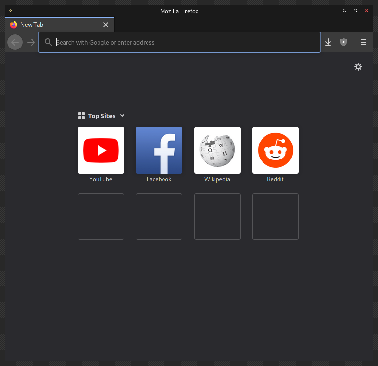
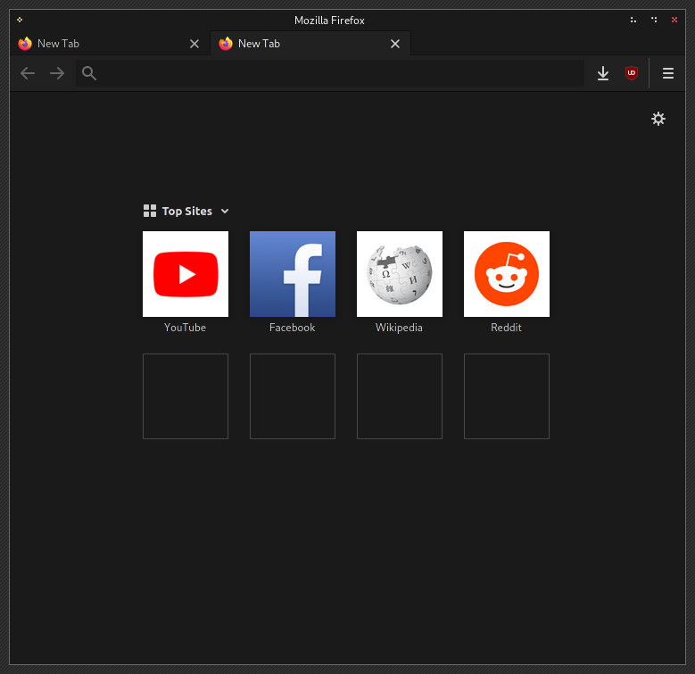

# Squarefox

Squarefox is a minimalistic and dark-theme oriented CSS modification to make firefox less ugly.
By default, the stock firefox uses rounded buttons in different designs (back/forward buttons),
big zoomed adress bars and color schemes that don't match the system colors
due to overlayed background images that distort the colors as they should be.

Squarefox removes those rounded borders, disables the zoomed address bar,
gets rid of the menubar toggle whenever <alt> was pressed to move a window,
hardcodes the colors as I want them to be, plus some other minor tweaks.

## Screenshot

|    Stock Firefox       |        Squarefox        |
| :--------------------- | -----------------------:|
|  |  |

## Install

1. Open `about:config` and set `toolkit.legacyUserProfileCustomizations.stylesheets` to `true`.
2. Locate your profile folder in `~/.mozilla/firefox`
3. Clone this repository into your profile as `chrome`:
```
git clone https://github.com/shagu/squarefox ~/.mozilla/firefox/d3f8ad12.default-release/chrome
```

4. Restart Firefox / Done

## About

The colors might not fit your settings, please have a look at the `./userChrome.css` to adjust them to your needs.
This CSS file was tested on Firefox 88.0.1 and might not work for other versions.

- `./userChrome.css` holds the css for the browser window
- `./userContent.css` holds the css for the start-page